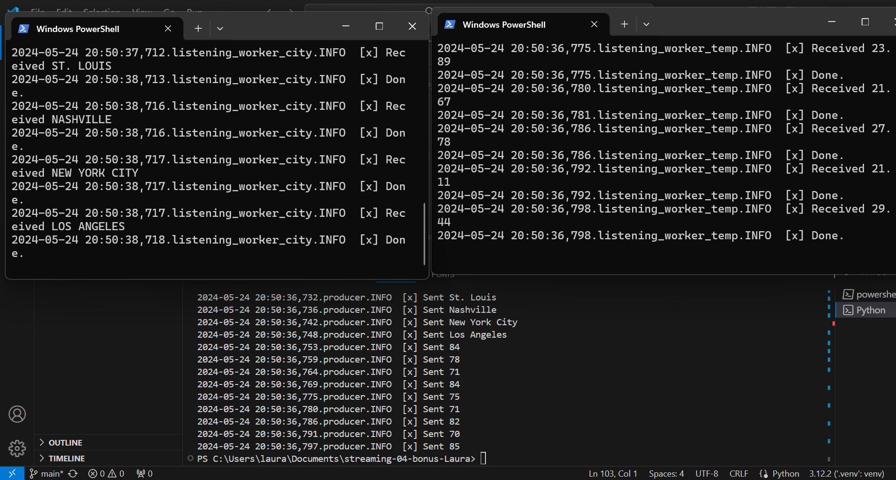

# streaming-04-bonus-Laura
## Laura Gagnon-Vos
### 05/24/2024

## Optional Bonus
Use your skills to create a custom project. Earn up to an additional 10%. Practice custom projects - this is the best way to learn. 

This project should read a multi-column CSV file (e.g. data1.csv), and send one of the columns to first_queue and one of the columns to second_queue (use better names) 

The first worker process will monitor the first queue, and "on getting a message" (that is, in the callback function) perform some analytics or transformation on the value (e.g., change a string to caps, change F to C),  then write a record with the original value, and the transformed result to a new second CSV file, e.g. data2.csv)
The second worker process will monitor the second queue, and "on getting a message" (that is, in the callback function) perform some analytics or transformation on the value (e.g., change a string to caps, change F to C),  then write a record with the original value, and the transformed result to a new third CSV file (e.g. data3.csv)

## For credit:

1. Create a new repo named streaming-04-bonus-yourname. (e.g., streaming-04-bonus-case)
2. Add a README.md, clone it down to your machine. 
3. On your machine, add a .gitignore. 
4. Add your producer (based on version 3 above) and your original csv file. 
5. Add your consumer1 and consumer2. 
6. The project should use RabbitMQ and be similar to Version 2 and Version 3 above, but process different data.
7. Name the files and so they are clear and well-organized in your repo, e.g., start all 3 csv file names with "data", so they appear together. 
8. Complete the README.md including:
    a short description of the project
    your name and date
    instructions on how to run your project
    a screenshot clearly showing your unique streaming process in action. 

# Instructions
1. In 2 separate terminals, run the listening_worker_city.py and listening_worker_temp.py scripts.
2. Run producer.py, filling in 'data.csv' when prompted what CSV to use.
The listeners each gather data from the producer, generating their own new CSV files containing original and transformed data.

## Screenshot: 
